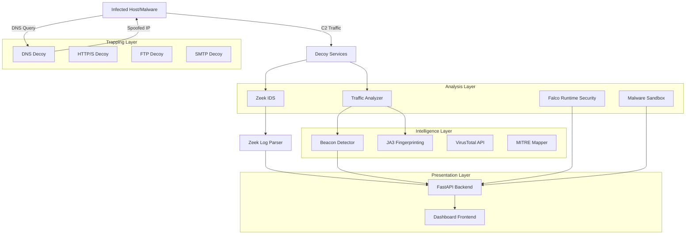

# C2Trap Technical Documentation & Presentation Guide

**Version:** 1.0.0
**Date:** February 2026
**Project:** Command & Control Detection System (Final Year Project)

---

## 📚 Table of Contents
1. [System Architecture](#system-architecture)
2. [Component Details](#component-details)
3. [Detection Algorithms](#detection-algorithms)
4. [Network Analysis (Zeek)](#network-analysis-zeek)
5. [Kill Chain Mapping](#kill-chain-mapping)
6. [Dashboard & Visualization](#dashboard--visualization)
7. [Deployment Guide](#deployment-guide)

---

## 1. System Architecture

C2Trap is a distributed deception platform designed to detect advanced persistent threats (APTs) during the Command & Control (C2) phase of the Cyber Kill Chain. It employs a microservices architecture orchestrated via Docker Compose.

### High-Level Design


---

## 2. Component Details

### 2.1 Decoy Services (The Trap)
These services mimic real C2 infrastructure to trick malware into revealing itself.

- **HTTP/HTTPS Decoy**:
  - **Technology**: Python Flask
  - **Port**: 8888 (HTTP), 8443 (HTTPS)
  - **Function**: Accepts arbitrary POST/GET requests. Returns realistic HTTP 200 OK responses with fake commands (e.g., base64 encoded "sleep").
  - **Key Feature**: Captures full payload, headers, and user-agents for analysis.

- **DNS Decoy**:
  - **Technology**: Python `dnslib` and `socket`
  - **Port**: 53 (UDP/TCP)
  - **Function**: Acts as a rogue DNS server. Resolves *any* domain (e.g., `evil-c2.com`) to the local IP of the HTTP decoy.
  - **Technique**: DNS Sinkholing/Spoofing.

- **FTP & SMTP Decoys**:
  - **Ports**: 21 (FTP), 25 (SMTP)
  - **Function**: Capture credentials and file exfiltration attempts.

### 2.2 Analysis Engine
The brain of C2Trap, responsible for processing raw network traffic.

- **Traffic Sniffer**: Uses `Scapy` to capture packets interacting with decoys.
- **Log Aggregator**: Consolidates events from all sources into `analysis_queue.jsonl`.
- **VirusTotal Integration**:
  - Automatically queries hashes (MD5/SHA256) of dropped files.
  - Enriches IP addresses and domains with reputation scores.
  - **Rate Limiting**: Implements caching to respect API limits.

---

## 3. Detection Algorithms

### 3.1 C2 Beacon Detection
Detects automated "callbacks" from malware to its C2 server.

**Algorithm Logic**:
1. **Connection Profiling**: Groups traffic by `(SrcIP, DstIP, DstPort, Protocol)`.
2. **Interval Analysis**: Calculates time differences ($\Delta t$) between consecutive connections.
3. **Jitter Calculation**: Measures variance in intervals to detect randomization (jitter).
   $$ \text{Jitter} \% = \frac{\text{StandardDeviation}}{\text{MeanInterval}} \times 100 $$
4. **Scoring**:
   - **High Score**: Low jitter (<10%), regular interval (e.g., exactly 30s).
   - **Low Score**: High burstiness, random user behavior.
   - **Threshold**: Connections with score > 80 are flagged as High Severity Beacons.

### 3.2 JA3 Fingerprinting
Identifies the client application based on its SSL/TLS handshake.

**Mechanism**:
- Extracts fields from Client Hello: `SSLVersion, Cipher, SSLExtension, EllipticCurve, EllipticCurvePointFormat`.
- Concatenates strings -> MD5 Hash.
- **Matching**: Compares against a database of known malware JA3 hashes (e.g., TrickBot, Emotet, Cobalt Strike).

### 3.3 MITRE ATT&CK Mapping
Automatically maps detected events to MITRE TTPs (Tactics, Techniques, and Procedures).

| Event Type | Mapped Technique | ID |
|------------|------------------|----|
| HTTP Traffic | Application Layer Protocol | T1071 |
| DNS Query | Application Layer Protocol: DNS | T1071.004 |
| Beacon | Web Service | T1102 |
| File Upload | Exfiltration Over C2 Channel | T1041 |
| Shell Command | Command and Scripting Interpreter | T1059 |

---

## 4. Network Analysis (Zeek)

C2Trap integrates **Zeek Network Monitor** (formerly Bro) for deep packet inspection.

### Integration Architecture
1. **Zeek Container**: Runs in `host` network mode to see all traffic.
2. **Log Generation**: Writes TSV logs (`conn.log`, `dns.log`, `http.log`) to shared volume.
3. **Zeek Parser Service** (Custom Component):
   - Monitors log directory for changes (tailing).
   - Parses TSV format into JSON.
   - Injects events into C2Trap's `analysis_queue.jsonl` with `zeek:` prefix.

### Key Logs Analyzed
- **conn.log**: Connection flow (duration, bytes, service).
- **dns.log**: DNS queries (domain, response code).
- **http.log**: HTTP methods, URIs, User-Agents.
- **ssl.log**: Certificate details and JA3 hashes.

---

## 5. Kill Chain Mapping

The system visualizes attacks across the **Cyber Kill Chain** phases.

### Phase Logic
1. **Reconnaissance**: Port scans, initial DNS queries.
2. **Delivery**: Phishing emails (SMTP decoy), File downloads.
3. **Exploitation**: Specific payloads targeting vulnerabilities.
4. **Installation**: Dropping second-stage payloads (FTP/HTTP upload).
5. **Command & Control**: Beaconing, Heartbeat traffic.
6. **Actions on Objectives**: Data exfiltration, Ransomware behavior.

**Visual Pipeline**:
The dashboard uses a custom CSS/JS pipeline to render this as an interactive timeline, highlighting the current stage of the attack in real-time.

---

## 6. Dashboard & Visualization

A modern SOC (Security Operations Center) dashboard built with:
- **Frontend**: HTML5, Vanilla JS, CSS Glassmorphism effects.
- **Backend**: FastAPI (High performance Python framework).
- **Communication**: Polling (5s interval) for near real-time updates.

### Key Views
1. **Command Center**: High-level stats, active threats breakdown.
2. **Live Traffic**: Raw feed of every packet/request.
3. **Threat Map**: Geographic visualization of source IPs (if public).
4. **Kill Chain**: Phase tracking.
5. **MITRE Matrix**: Heatmap of detected techniques.

### Security (Falco)
Runtime security monitoring using Falco.
- **Monitors**: System calls (syscalls).
- **Detects**: Shell spawning in containers, modifying binary files, sensitive file reads.
- **Rules**: Custom rules defined in `config/falco/falco.yaml`.

---

## 7. Deployment Guide

### Prerequisites
- Linux OS (Kali/Ubuntu recommended)
- Docker & Docker Compose
- Python 3.11+
- Root privileges (for packet capture)

### Installation
```bash
# 1. Clone Repository
git clone https://github.com/shree/c2trap.git
cd c2trap

# 2. Configure Environment
# Add VirusTotal API key in config/virustotal.env

# 3. Start Services
sudo ./scripts/start_all.sh
```

### Verification
1. Access Dashboard: `http://localhost:8000`
2. Run Simulation:
   ```bash
   python3 scripts/test_c2.py
   ```
3. Check Logs:
   ```bash
   tail -f logs/analysis_queue.jsonl
   ```

### Troubleshooting
- **No Zeek Data**: Ensure `zeek_parser` container is running (`docker ps`).
- **Dashboard Empty**: Check permissions on `logs/` directory.
- **Port Conflicts**: Ensure ports 80, 53, 21 are free on host.
